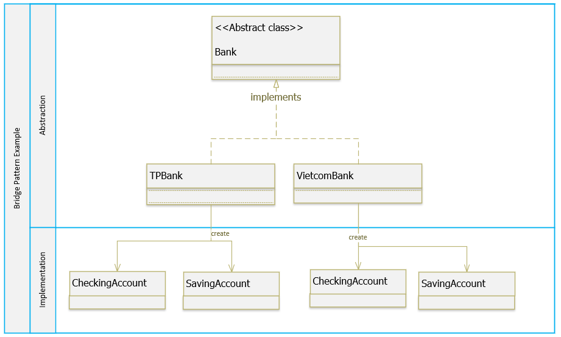
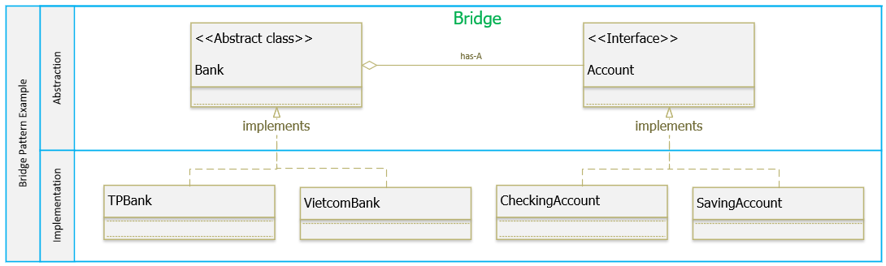

**Bridge Pattern**

_Decouple an abstraction from its implementation so that the two can vary independently._

Example

Một hệ thống ngân hàng cung cấp các loại tài khoản khác nhau cho khách hàng, chẳng hạn: Checking account và Saving account. Chúng ta có sơ đồ như sau:

Với cách thiết kế như vậy, khi hệ thống cần cung cấp thêm một loại tài khoản khác, chúng ta phải tạo class mới cho tất cả các ngân hàng, số lượng class tăng lên rất nhiều.

Bây giờ, chúng ta sẽ sử dụng Bridge Pattern để tái cấu trúc lại hệ thống trên như sau:

Như vậy mỗi khi có một loại tài khoản mới chúng ta sẽ chỉ cần thêm một implementor của **Account**